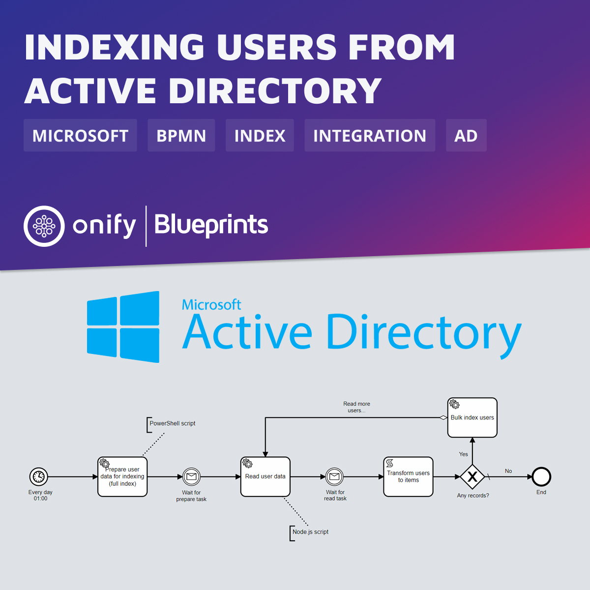

# Onify Blueprint: Indexing users from Active Directory

This Blueprint gets all (depending on config) users from Microsoft Active Directory and index them to Onify. To integrate with AD we use the `Onify.ActiveDirectory` PowerShell module (by [Tony Aronsson](https://github.com/Aronsson84) @ [Zitac](https://github.com/zitacconsulting)) to both be able to do full index or delta index if needed. With the `Onify.ActiveDirectory` module, we can index anything from AD, like users, computers, groups, etc. 

## Screenshots

## Requirements

* Onify Hub API 2.3.0 or later
* Onify Agent (tagged `agent`)
* Onify Flow license
* Camunda Modeler 4.4 or later 
* Node.js v12 or higher (on agent)
* PowerShell v5 or higher (on agent)

## Included

* Workflow (Flow) 
* Agent scripts
* `Onify.ActiveDirectory` PowerShell module

## Setup

### Onify Agent 

* Copy files from `.\resources\agent\scripts` to `.\scripts` folder on Onify Agent.

### Active Directory integration

Setup the AD integration using `Onify.ActiveDirectory` PowerShell module.

#### Configuration

1. Go the the Onify Agent `.\scripts\Onify.ActiveDirectory` folder
2. Open `config.json`
3. Replace `dc01.contoso.com` with your own domain controller
4. Replace `contoso.com` with your own domain name
5. Replace `DC=contoso,DC=com` with your own domain base
6. Update `searchBase` if needed
7. Add or remove properties in `property` field if needed (used for templates)

#### Templates

1. Go the the Onify Agent `.\scripts\Onify.ActiveDirectory\templates` folder
2. Rename the `contoso.com` folder with your own domain name
3. Update the template files (*.json) if needed

## Workflow

> NOTE: By deploying or running the flow you will also schedule it to be run every day at 01:00. This can be changed if needed.

### Deploy

1. Open `activedirectory-index-users.bpmn` in Camunda Modeler
2. Customize the flow (optional)
3. Click `Deploy current diagram` and follow the steps

### Run 

1. Open `activedirectory-index-users.bpmn` in Camunda Modeler
2. Click `Start current diagram`

## Support

* Community/forum: https://support.onify.co/discuss
* Documentation: https://support.onify.co/docs
* Support and SLA: https://support.onify.co/docs/get-support

## License

This project is licensed under the MIT License - see the [LICENSE](LICENSE) file for details.

## Contributors

Thanks [Tony Aronsson](https://github.com/Aronsson84) @ [Zitac](https://github.com/zitacconsulting) for great work with the PowerShell scripts and modules.
